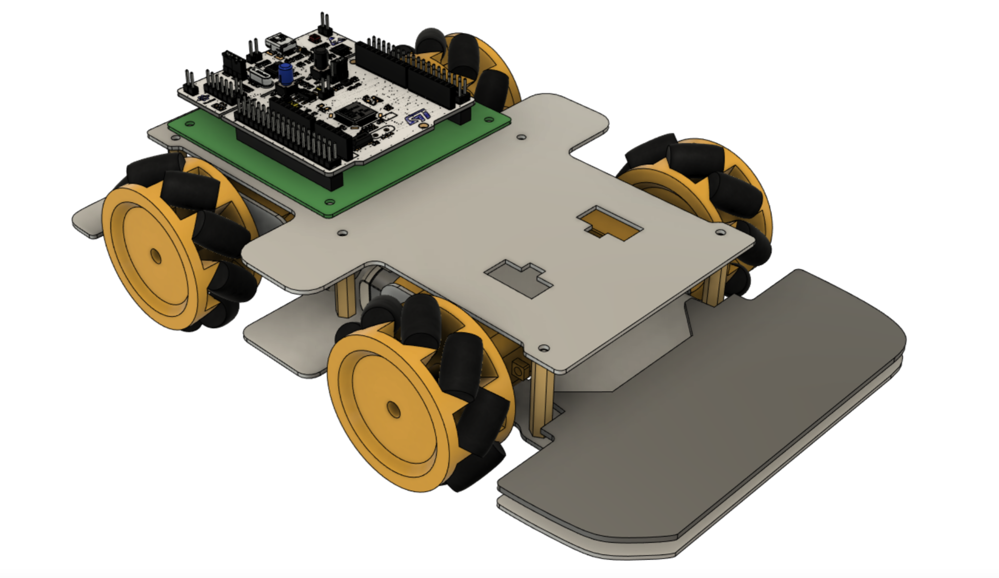

# mcu-lectorium-cource
Материалы по курсу "Микроконтроллерные системы управления" на платформе Лекториум

## организация репозитория

**/continuous assesment** – папка, в которой расположены дополнительные материалы для выполнения соответстующих заданий курса

**/mobile robot** – папка с исходной моделью мобильного робота, на базе которого нужно выполнить финальное задание

*вид мобильной платформы*